# Ejercicio 1 - Aviación Civil

## Enunciado

La Administración Nacional de Aviación Civil necesita una serie de informes para elevar al
ministerio de transporte acerca de los aterrizajes y despegues en todo el territorio Argentino,
como puede ser: cuales aviones son los que más volaron, cuántos pasajeros volaron, ciudades
de partidas y aterrizajes entre fechas determinadas, etc.

Usted como data engineer deberá realizar un pipeline con esta información, automatizarlo y
realizar los análisis de datos solicitados que permita responder las preguntas de negocio, y
hacer sus recomendaciones con respecto al estado actual.

## Tareas

### 1 - Ingesta de Datos

1. Hacer ingest de los siguientes archivos relacionados con transporte aéreo de Argentina

    - [Informe Ministerio 2021] <https://dataengineerpublic.blob.core.windows.net/data-engineer/2021-informe-ministerio.csv>
    - [Informe Ministerio 2022] <https://dataengineerpublic.blob.core.windows.net/data-engineer/202206-informe-ministerio.csv>
    - [Detalles Aeropuertos] <https://dataengineerpublic.blob.core.windows.net/data-engineer/aeropuertos_detalle.csv>

    Script de Ingesta a HDFS
    El siguiente script descargará los archivos necesarios desde las URLs indicadas y los cargará en HDFS en la ruta `/ingest/aviation_data`:

    `/home/hadoop/scripts/ingest/anac/ingest.sh`

    ```bash
    !/bin/bash

    # Configuración de directorios

    LOCAL_INGEST_DIR="${LOCAL_INGEST_DIR:-/home/hadoop/ingest/aviation_data}"
    HDFS_DEST_DIR="${HDFS_DEST_DIR:-/ingest/aviation_data}"

    # URLs de los datasets

    URL_2021="<https://dataengineerpublic.blob.core.windows.net/data-engineer/2021-informe-ministerio.csv>"
    URL_2022="<https://dataengineerpublic.blob.core.windows.net/data-engineer/202206-informe-ministerio.csv>"
    URL_AEROPUERTOS="<https://dataengineerpublic.blob.core.windows.net/data-engineer/aeropuertos_detalle.csv>"

    # Crear directorio local si no existe

    mkdir -p $LOCAL_INGEST_DIR

    echo "Comenzando la descarga de archivos..."

    # Descargar archivos con validación

    for url in "$URL_2021" "$URL_2022" "$URL_AEROPUERTOS"; do
    filename=$(basename "$url")
    if [ ! -f "$LOCAL_INGEST_DIR/$filename" ]; then
        echo "Descargando $filename..."
        wget -q -P "$LOCAL_INGEST_DIR" "$url" || { echo "Error descargando $filename"; exit 1; }
    else
        echo "$filename ya existe, omitiendo descarga."
    fi
    done

    echo "Archivos descargados exitosamente en $LOCAL_INGEST_DIR"

    # Crear directorio en HDFS si no existe

    echo "Creando directorio en HDFS..."
    hdfs dfs -mkdir -p "$HDFS_DEST_DIR" || { echo "Error creando directorio en HDFS"; exit 1; }

    # Subir archivos a HDFS

    echo "Subiendo archivos a HDFS..."
    hdfs dfs -put -f "$LOCAL_INGEST_DIR"/*.csv "$HDFS_DEST_DIR" || { echo "Error subiendo archivos a HDFS"; exit 1; }

    echo "Archivos cargados exitosamente en HDFS en la ruta: $HDFS_DEST_DIR"

    ```

### 2 - Creación de Tablas en Hive (nuestro data warehouse en este caso)

Punto 2

Los siguientes comandos SQL crean las tablas requeridas en Hive:

```sql

CREATE DATABASE IF NOT EXISTS aviation_db;

USE aviation_db;

-- tabla para los vuelos realizados en 2021 y 2022
CREATE EXTERNAL TABLE IF NOT EXISTS aeropuerto_tabla (
    fecha DATE COMMENT 'Fecha del vuelo',
    horaUTC STRING COMMENT 'Hora en formato UTC',
    clase_de_vuelo STRING COMMENT 'Clase del vuelo: comercial, privado, etc.',
    clasificacion_de_vuelo STRING COMMENT 'Clasificación del vuelo: nacional, internacional',
    tipo_de_movimiento STRING COMMENT 'Tipo de movimiento: aterrizaje, despegue',
    aeropuerto STRING COMMENT 'Aeropuerto de origen o destino',
    origen_destino STRING COMMENT 'Código del aeropuerto de origen o destino',
    aerolinea_nombre STRING COMMENT 'Nombre de la aerolínea',
    aeronave STRING COMMENT 'Modelo de la aeronave',
    pasajeros INT COMMENT 'Número de pasajeros en el vuelo'
)
STORED AS PARQUET
LOCATION '/aviation_data/flights';

-- tabla para el detalle de los aeropuertos
CREATE EXTERNAL TABLE IF NOT EXISTS aeropuerto_detalles_tabla (
    aeropuerto STRING COMMENT 'Nombre del aeropuerto',
    oac STRING COMMENT 'Código OAC del aeropuerto',
    iata STRING COMMENT 'Código IATA del aeropuerto',
    tipo STRING COMMENT 'Tipo de aeropuerto',
    denominacion STRING COMMENT 'Denominación del aeropuerto',
    coordenadas STRING COMMENT 'Coordenadas del aeropuerto',
    latitud STRING COMMENT 'Latitud del aeropuerto',
    longitud STRING COMMENT 'Longitud del aeropuerto',
    elev FLOAT COMMENT 'Elevación del aeropuerto',
    uom_elev STRING COMMENT 'Unidad de medida de la elevación',
    ref STRING COMMENT 'Referencia del aeropuerto',
    distancia_ref FLOAT COMMENT 'Distancia a la referencia',
    direccion_ref STRING COMMENT 'Dirección a la referencia',
    condicion STRING COMMENT 'Condición del aeropuerto',
    control STRING COMMENT 'Control del aeropuerto',
    region STRING COMMENT 'Región del aeropuerto',
    uso STRING COMMENT 'Uso del aeropuerto',
    trafico STRING COMMENT 'Tipo de tráfico del aeropuerto',
    sna STRING COMMENT 'Código SNA',
    concesionado STRING COMMENT 'Concesión del aeropuerto',
    provincia STRING COMMENT 'Provincia del aeropuerto'
)
STORED AS PARQUET
LOCATION '/aviation_data/airport_details';
```

### 3 - Orquestacion  y Transformación

Punto 3

DAG de Airflow para la ingesta y transformación
Estructura del DAG:

- Tarea de ingesta: `ingest.sh` para descargar y cargar los archivos a HDFS.
- Tareas de transformación: Scripts PySpark `transform_vuelos.py` y `transform_aeropuertos.py` para realizar las transformaciones y cargar los datos en Hive.

DAG de Airflow para la ingesta y transformación de los datos de aviación civil `dag_anac.py`:

```python
from airflow import DAG
from airflow.operators.bash import BashOperator
from airflow.operators.dummy import DummyOperator
from airflow.utils.dates import days_ago

# Argumentos por defecto
default_args = {
    'owner': 'Lucas Leonetti',
    'depends_on_past': False,
    'email_on_failure': False,
    'email_on_retry': False,
    'retries': 1,
}

# Definir el DAG
with DAG(
    'aviation_etl_pipeline',
    default_args=default_args,
    description='ETL Pipeline for ANAC aviation data',
    schedule_interval=None,
    start_date=days_ago(1),
    tags=['aviation', 'spark', 'hive', 'hdfs'],
) as dag:

    # Inicio del proceso
    start_process = DummyOperator(
        task_id='start_process',
    )

    # Ingesta de datos en HDFS
    ingest_data = BashOperator(
        task_id='ingest_data',
        bash_command=" export PATH=/home/hadoop/hadoop/bin:/usr/lib/sqoop/bin:$PATH && \
                /usr/bin/sh /home/hadoop/scripts/ingest/anac/ingest.sh ",
    )

    # Transformación y carga de datos de vuelos con PySpark
    transform_and_load_vuelos = BashOperator(
        task_id='transform_and_load_vuelos',
        bash_command="""
        export PATH=/home/hadoop/spark/bin:/usr/lib/sqoop/bin:$PATH &&
        ssh hadoop@172.17.0.2 '/home/hadoop/spark/bin/spark-submit \
        --files /home/hadoop/hive/conf/hive-site.xml \
        /home/hadoop/scripts/transform/transform_vuelos.py '
         """,
    )

    # Transformación y carga de datos de aeropuertos con PySpark
    transform_and_load_aeropuertos = BashOperator(
        task_id='transform_and_load_aeropuertos',
        bash_command="""
       export PATH=/home/hadoop/spark/bin:/usr/lib/sqoop/bin:$PATH &&
        ssh hadoop@172.17.0.2 '/home/hadoop/spark/bin/spark-submit \
        --files /home/hadoop/hive/conf/hive-site.xml \
        /home/hadoop/scripts/transform/transform_aeropuerto.py '
         """,
    )

    # Final del proceso
    end_process = DummyOperator(
        task_id='end_process',
    )

    # Dependencias del flujo
    start_process >> ingest_data
    ingest_data >> [transform_and_load_vuelos, transform_and_load_aeropuertos]
    [transform_and_load_vuelos, transform_and_load_aeropuertos] >> end_process
```

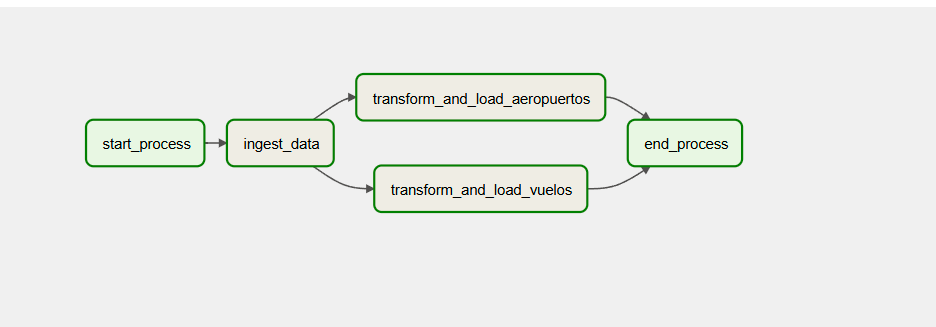
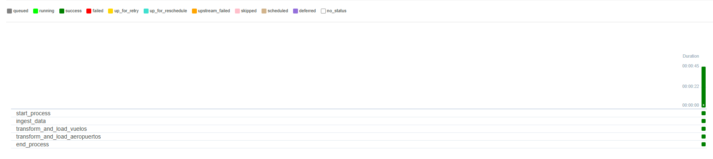

Punto 4

Script para la transformación de datos de vuelos - PySpark `transform_vuelos.py`:

Transformaciones de los datos de vuelos, incluyendo la normalización de nombres de columnas, filtrado de vuelos domésticos, unión de datasets, transformación de tipos, manejo de valores nulos y filtrado por rango de fechas

```python
from pyspark.sql import SparkSession
from pyspark.sql.functions import col, when, to_date, lit, regexp_replace

# Crear la sesión de Spark con soporte para Hive
spark = SparkSession.builder \
    .appName("TransformacionVuelos") \
    .enableHiveSupport() \
    .getOrCreate()

# Rutas de los archivos en HDFS
vuelos_2021_path = "hdfs://172.17.0.2:9000/ingest/aviation_data/2021-informe-ministerio.csv"
vuelos_2022_path = "hdfs://172.17.0.2:9000/ingest/aviation_data/202206-informe-ministerio.csv"

# Función para normalizar nombres de columnas al formato Hive
def normalize_columns(df):
    return df.toDF(*[c.strip().lower()
                     .replace(" ", "_")
                     .replace("(", "")
                     .replace(")", "")
                     .replace("/", "_")
                     .replace("á", "a")
                     .replace("é", "e")
                     .replace("í", "i")
                     .replace("ó", "o")
                     .replace("ú", "u") for c in df.columns])

# Leer datasets
vuelos_df_2021 = spark.read.option("header", True).option("delimiter", ";").csv(vuelos_2021_path)
vuelos_df_2022 = spark.read.option("header", True).option("delimiter", ";").csv(vuelos_2022_path)

# Normalizar nombres de columnas
vuelos_df_2021 = normalize_columns(vuelos_df_2021)
vuelos_df_2022 = normalize_columns(vuelos_df_2022)

# Filtrar vuelos domésticos
def filter_domesticos(df):
    return df.filter(regexp_replace(col("clasificacion_vuelo"), "é", "e").rlike("(?i)^domestico$"))

vuelos_df_2021 = filter_domesticos(vuelos_df_2021)
vuelos_df_2022 = filter_domesticos(vuelos_df_2022)

# Unir datasets
vuelos_df = vuelos_df_2021.unionByName(vuelos_df_2022)

# Transformar tipos y eliminar columnas innecesarias
vuelos_df = vuelos_df.withColumn("fecha", to_date(col("fecha"), "dd/MM/yyyy")) \
                     .drop("calidad_dato", "pax")

# Manejar valores nulos en 'pasajeros'
vuelos_df = vuelos_df.withColumn("pasajeros", when(col("pasajeros").isNull(), lit(0)).otherwise(col("pasajeros")).cast("int"))

# Renombrar columnas
vuelos_df = vuelos_df.withColumnRenamed("clase_de_vuelo_todos_los_vuelos", "clase_de_vuelo") \
                     .withColumnRenamed("origen___destino", "origen_destino")


# Filtrar rango de fechas
vuelos_df = vuelos_df.filter((col("fecha") >= lit("2021-01-01")) & (col("fecha") <= lit("2022-06-30")))

# Escribir en Hive
hive_db = "aviation_db"
hive_table = "aeropuerto_tabla"

vuelos_df.write.mode("overwrite").insertInto(f"{hive_db}.{hive_table}")

# Finalizar sesión de Spark
spark.stop()
```

Punto 4

Script para la transformación de datos de aeropuertos - PySpark `transform_aeropuertos.py`:

transformaciones de los datos de aeropuertos, incluyendo la normalización de nombres de columnas, eliminación de columnas innecesarias, manejo de valores nulos y cast de tipos de datos

```python
from pyspark.sql import SparkSession
from pyspark.sql.functions import col, when, lit

# Crear la sesión de Spark con soporte para Hive
spark = SparkSession.builder \
    .appName("ProcessAeropuertosData") \
    .enableHiveSupport() \
    .getOrCreate()

# Ruta del archivo en HDFS
aeropuertos_path = "hdfs://172.17.0.2:9000/ingest/aviation_data/aeropuertos_detalle.csv"

# Función para normalizar nombres de columnas
def normalize_columns(df):
    return df.toDF(*[c.strip().lower()
                     .replace(" ", "_")
                     .replace("(", "")
                     .replace(")", "")
                     .replace("/", "_")
                     .replace("á", "a")
                     .replace("é", "e")
                     .replace("í", "i")
                     .replace("ó", "o")
                     .replace("ú", "u") for c in df.columns])

# Leer y normalizar el archivo de detalles de aeropuertos
aeropuertos_df = spark.read.option("header", True).option("delimiter", ";").csv(aeropuertos_path)
aeropuertos_df = normalize_columns(aeropuertos_df)

# Eliminar columnas innecesarias y reemplazar valores nulos en "distancia_ref", castear "elev" a FLOAT 
aeropuertos_df = aeropuertos_df \
    .drop("inhab", "fir") \
    .withColumn("distancia_ref", when(col("distancia_ref").isNull(), lit(0)).otherwise(col("distancia_ref")).cast("float")) \
    .withColumn("elev", when(col("elev").isNull(), lit(0)).otherwise(col("elev")).cast("float"))

aeropuertos_df = aeropuertos_df.withColumnRenamed("local", "aeropuerto")

# Guardar en la tabla Hive
hive_db = "aviation_db"
hive_table_aeropuertos = "aeropuerto_detalles_tabla"
aeropuertos_df.write.mode("overwrite").insertInto(f"{hive_db}.{hive_table_aeropuertos}")

# Finalizar la sesión de Spark
spark.stop()
```

Punto 5

Tipos de campos en las tablas de Hive:

Tabla `aeropuerto_tabla`:
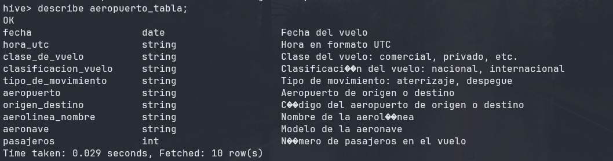

Tabla `aeropuerto_detalles_tabla`:
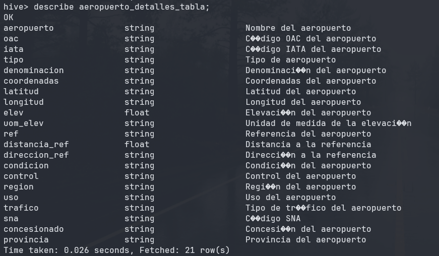

### Análisis de Datos

Punto 6

Consultas SQL para responder a las preguntas de negocio:

Para trabajar con las tablas en Hive, se pueden ejecutar consultas SQL para responder a las preguntas de negocio planteadas. Se utilizo DBeaver para ejecutar las mismas y Looker Studio para visualizar los resultados en forma de gráficos y tablas.

>Determinar la cantidad de vuelos entre las fechas 01/12/2021 y 31/01/2022.

```sql
SELECT COUNT(*) AS cantidad_vuelos
FROM aeropuerto_tabla
WHERE fecha BETWEEN '2021-12-01' AND '2022-01-31';
```


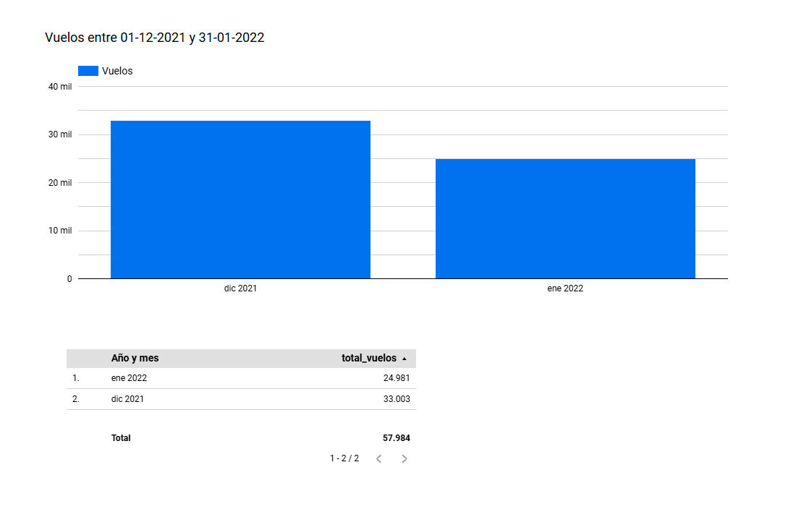

Punto 7

>Cantidad de pasajeros que viajaron en Aerolíneas Argentinas entre el 01/01/2021 y
30/06/2022.

```sql
SELECT SUM(pasajeros) AS total_pasajeros
FROM aeropuerto_tabla
WHERE aerolinea_nombre = 'AEROLINEAS ARGENTINAS SA'
  AND fecha BETWEEN '2021-01-01' AND '2022-06-30';
```


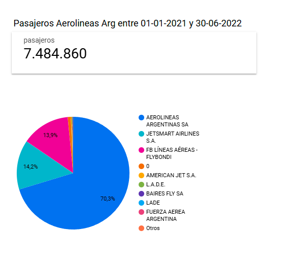

Punto 8

>Mostrar fecha, hora, código aeropuerto salida, ciudad de salida, código de aeropuerto
de arribo, ciudad de arribo, y cantidad de pasajeros de cada vuelo, entre el 01/01/2022
y el 30/06/2022 ordenados por fecha de manera descendiente.

```sql
SELECT 
    vuelos.fecha,
    vuelos.hora_utc,
    vuelos.aeropuerto AS codigo_aeropuerto_salida,
    salida.denominacion AS ciudad_salida,
    CASE 
        WHEN vuelos.tipo_de_movimiento = 'Aterrizaje' THEN vuelos.aeropuerto
        ELSE vuelos.origen_destino
    END AS codigo_aeropuerto_arribo,
    CASE 
        WHEN vuelos.tipo_de_movimiento = 'Aterrizaje' THEN llegada.denominacion
        ELSE salida.denominacion
    END AS ciudad_arribo,
    vuelos.pasajeros
FROM 
    aeropuerto_tabla AS vuelos
LEFT JOIN 
    aeropuerto_detalles_tabla AS salida
ON 
    vuelos.aeropuerto = salida.aeropuerto
LEFT JOIN 
    aeropuerto_detalles_tabla AS llegada
ON 
    vuelos.origen_destino = llegada.aeropuerto
WHERE 
    vuelos.fecha BETWEEN '2022-01-01' AND '2022-06-30'
ORDER BY 
    vuelos.fecha DESC;
```

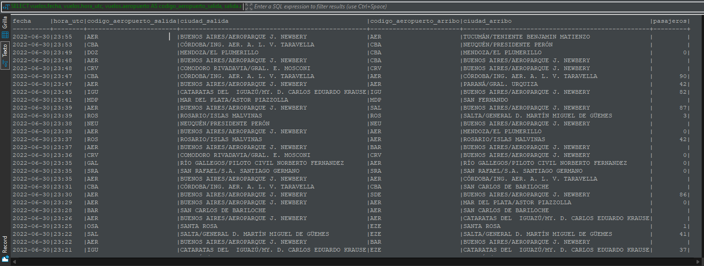
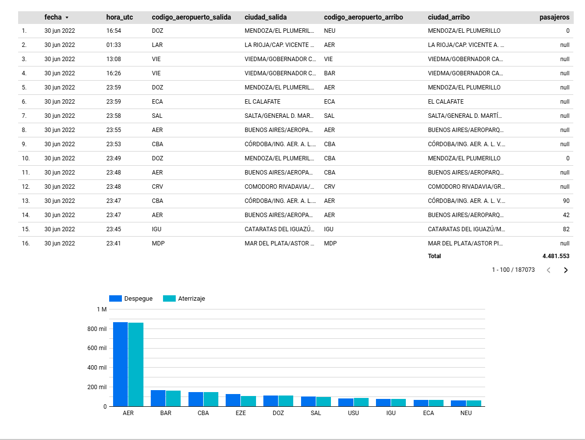

Punto 9

>Las 10 aerolíneas que más pasajeros llevaron entre el 01/01/2021 y el
30/06/2022 exceptuando aquellas aerolíneas que no tengan nombre

```sql
SELECT 
    aerolinea_nombre,
    SUM(pasajeros) AS total_pasajeros
FROM 
    aeropuerto_tabla
WHERE 
    fecha BETWEEN '2021-01-01' AND '2022-06-30'
    AND aerolinea_nombre IS NOT NULL
    AND aerolinea_nombre != ''
    AND aerolinea_nombre != '0'
GROUP BY 
    aerolinea_nombre
ORDER BY 
    total_pasajeros DESC
LIMIT 10;
```

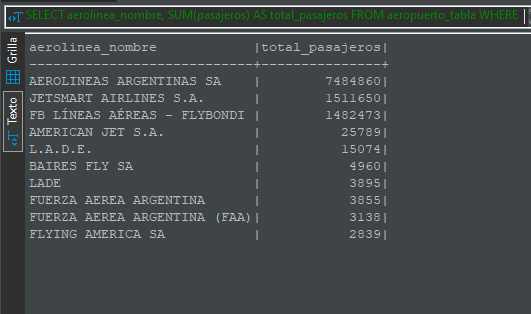
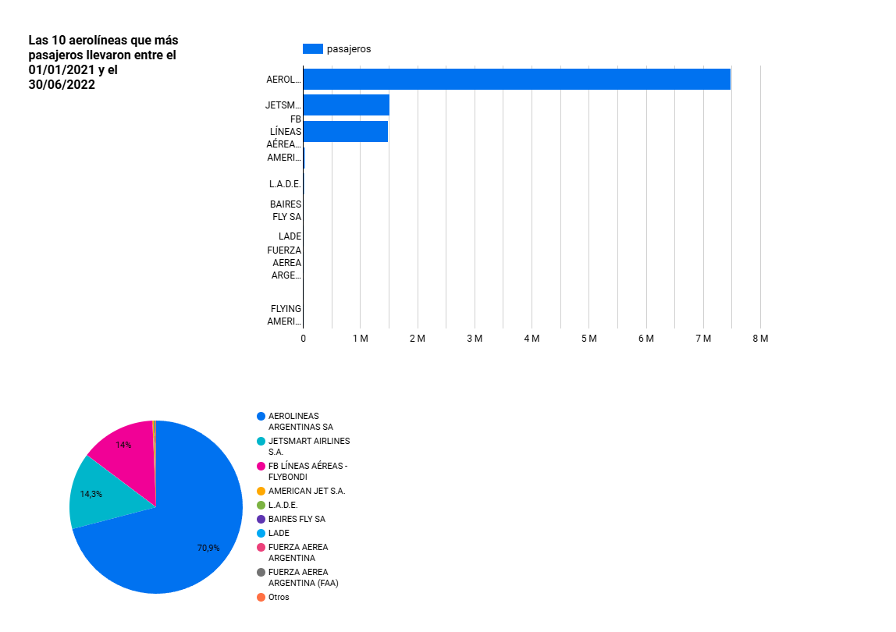

Punto 10

>Las 10 aeronaves más utilizadas entre el 01/01/2021 y el 30/06/22 que
despegaron desde la Ciudad autónoma de Buenos Aires o de Buenos Aires,
exceptuando aquellas aeronaves que no cuentan con nombre

```sql
SELECT 
    aeronave,
    COUNT(*) AS total_vuelos
FROM 
    aeropuerto_tabla
WHERE 
    fecha BETWEEN '2021-01-01' AND '2022-06-30'
    AND tipo_de_movimiento = 'Despegue' 
    AND LOWER(aeropuerto) IN ('aer', 'eze') 
    AND aeronave IS NOT NULL
    AND aeronave != ''
    AND aeronave != '0'
GROUP BY 
    aeronave
ORDER BY 
    total_vuelos DESC
LIMIT 10;
```

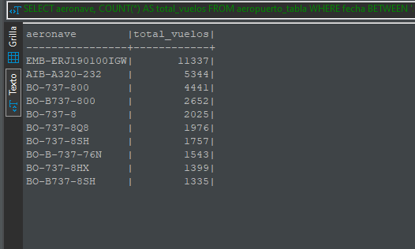
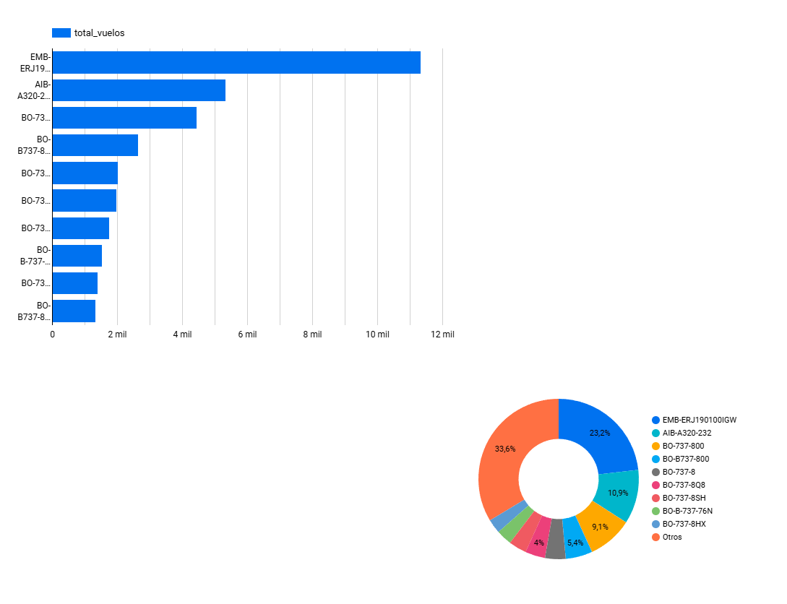

Punto 11

> *Qué datos externos agregaría en este dataset que mejoraría el análisis de los datos?*

Agregaria informacion sobre el clima en las ciudades de origen y destino, analizar si el mismo influye en la cantidad de vuelos y pasajeros. También agregaría información sobre el estado de los aeropuertos, como si están en funcionamiento, si hay demoras, etc. Además, inlcuir información sobre la puntualidad de las aerolíneas y la cantidad de vuelos cancelados, para poder analizar la calidad del servicio de las aerolíneas asi como tambien informacion socioeconomica de las ciudades de origen y destino para poder analizar si influye en la cantidad de vuelos y pasajeros.

Encuestas de satisfacción de los pasajeros para poder correlacionar la percepcion del servicio con el rendimiento de las aerolíneas y los aeropuertos. Agregar datos sobre el trafico en los aeropuertos para poder analizar si influye en la cantidad de vuelos y pasajeros y evaluar su impacto en retrasos y cancelaciones.

Punto 12

> *Conclusiones y Recomendaciones*

En base a los análisis realizados, se puede concluir que la cantidad de vuelos y pasajeros en Argentina ha aumentado en el primer semestre de 2022 en comparación con el año 2021. Aerolíneas Argentinas es la aerolínea que más pasajeros ha transportado en el período analizado, seguida por Jet Smart y Flybondi. Las aeronaves más utilizadas en vuelos desde Buenos Aires son los EMB-ERJ (Embraer) y Boeing 737-800 seguidos por el Airbus A-320.

Recomiendo realizar un análisis más detallado de los factores que influyen en el aumento de la cantidad de vuelos y pasajeros, como la situación económica, la situacion post pandemia de COVID-19, las restricciones de viaje y la competencia en el mercado aéreo. Además, se sugiere agregar datos externos como el clima, el estado de los aeropuertos, la puntualidad de las aerolíneas y las encuestas de satisfacción de los pasajeros.

Seria bueno crear Dashboards interactivos para visualizar los datos y realizar análisis más detallados y dinámicos. También se sugiere implementar un sistema de alertas para detectar anomalías en los datos y tomar medidas preventivas en caso de problemas.

Punto 13

>*Proponer una arquitectura alternativa para este proceso ya sea con herramientas on
premise o cloud (Sí aplica)*

Arquitectura Propuesta en Google Cloud Platform (GCP)

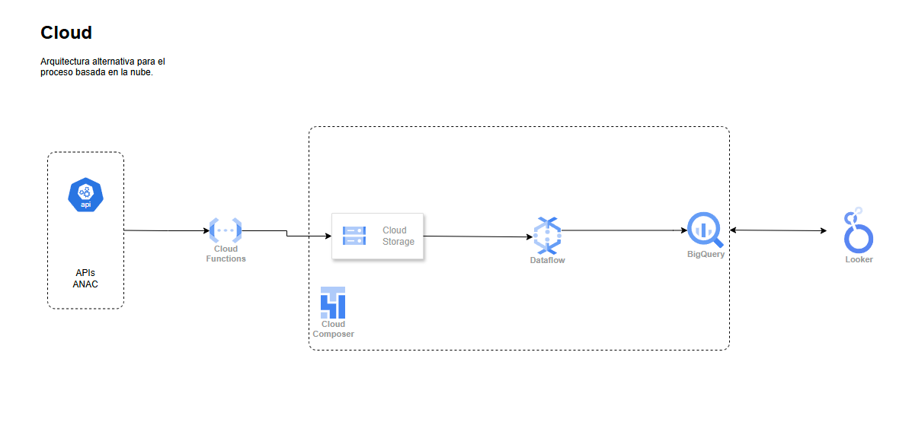

>Descripción General

La solución basada en GCP está diseñada para aprovechar la escalabilidad, facilidad de integración y servicios completamente gestionados que ofrece la plataforma. La arquitectura captura, transforma y analiza datos del tráfico aéreo mientras garantiza alta disponibilidad y una experiencia optimizada para análisis y visualización.

>*Componentes Principales:*

**APIs ANAC**

Fuente principal de datos. Proporciona información en formato JSON o CSV acerca de los datos de la aviacion nacional.

**Cloud Functions**

Responsable de la ingesta de datos desde las APIs.
Configurada para activarse por eventos (e.g., llamadas programadas o cambios en la fuente). Transforma y almacena los datos crudos en Cloud Storage.

**Cloud Storage**

Actúa como un repositorio centralizado para almacenar los datos en formato bruto.
Proporciona alta disponibilidad y capacidad de escalabilidad para manejar grandes volúmenes de datos.

**Dataflow**

Herramienta para la transformación y procesamiento de datos en tiempo real o batch.
Realiza:
Limpieza y transformación de datos (e.g., normalización, eliminación de nulos, formateo).
Unión con otras fuentes de datos si es necesario.
Escribe los datos transformados en BigQuery para su análisis.

**BigQuery**

Almacén de datos analíticos para consultas rápidas y escalables.
Permite realizar análisis multidimensionales y crear vistas para reportes específicos.
Compatible con herramientas de visualización como Looker.

**Looker**

Plataforma de visualización de datos conectada directamente a BigQuery.
Permite la creación de dashboards interactivos y reportes personalizados para responder a preguntas de negocio.

**Cloud Composer**

Orquesta todo el pipeline utilizando DAGs (Directed Acyclic Graphs).
Coordina las dependencias entre tareas y asegura la ejecución fluida del proceso.

>*Flujo de Trabajo*

**Ingesta de Datos**

Las APIs generan los datos, que son recolectados por Cloud Functions.
Cloud Functions almacena los datos crudos en Cloud Storage.

**Transformación**

Dataflow toma los datos desde Cloud Storage, los procesa y realiza las transformaciones necesarias:
Renombrado de columnas.
Casteo de tipos.
Filtrado de registros no válidos.
Los datos procesados se envían a BigQuery.

**Almacenamiento y Análisis**

Los datos transformados se almacenan en BigQuery, listos para consultas.
Se crean vistas en BigQuery para responder preguntas de negocio.

**Visualización**

Looker conecta con BigQuery para proporcionar reportes y dashboards basados en los datos analizados.
